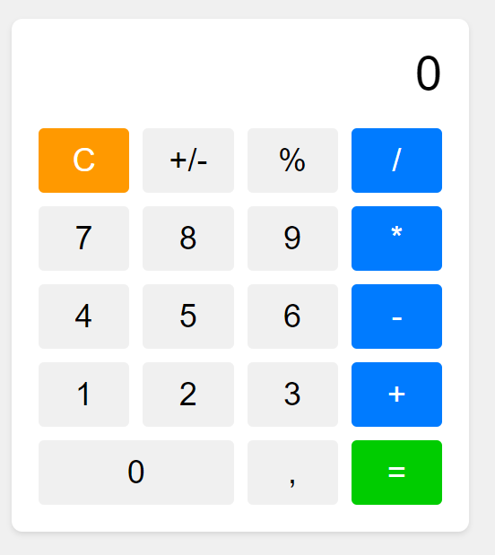

# Calculator

Une calculatrice interactive en ligne qui permet d'effectuer des opérations arithmétiques de base sur des nombres entiers et décimaux.

## Fonctionnalités

- Affiche le nombre actuellement saisi ou le résultat de la dernière opération.
- Boutons pour les chiffres de 0 à 9, les opérations (+, -, *, /), le point décimal (.), et les boutons spéciaux (+/-) et (%).
- Réinitialisation de la saisie et des opérations en cours avec le bouton "C".
- Calcul du pourcentage et inversion de signe avec les boutons spéciaux (% et +/-).
- Opérations en chaîne : Affiche les résultats partiels au fur et à mesure de l'entrée des opérations.
- Affiche "ERR" si une opération dépasse 8 chiffres.

## Capture d'écran

## Comment Utiliser

1. Ouvrez le fichier `index.html` dans votre navigateur pour charger la calculatrice.
2. Cliquez sur les boutons numériques pour entrer les chiffres.
3. Cliquez sur les boutons d'opération (+, -, *, /) pour effectuer des opérations.
4. Utilisez les boutons spéciaux (+/-) et (%) pour inverser le signe ou calculer le pourcentage.
5. Cliquez sur le bouton "C" pour effacer l'entrée en cours ou les opérations en cours.
6. Cliquez sur le bouton "=" pour afficher le résultat de l'opération.
7. Le résultat s'affiche à l'écran dans la zone de l'affichage.

## Technologies Utilisées

- HTML
- CSS
- JavaScript

## Remarque

Cette calculatrice a été créée dans un but éducatif pour pratiquer les concepts de base en HTML, CSS et JavaScript.

## Auteur
GitHub: [AsKing07](https://github.com/AsKing07)
Site Web: [Mon Portfolio](https://asking07.github.io/MyPortfolio/)

## Licence

Ce projet est sous licence MIT. Voir le fichier [LICENSE](LICENSE) pour plus de détails.
